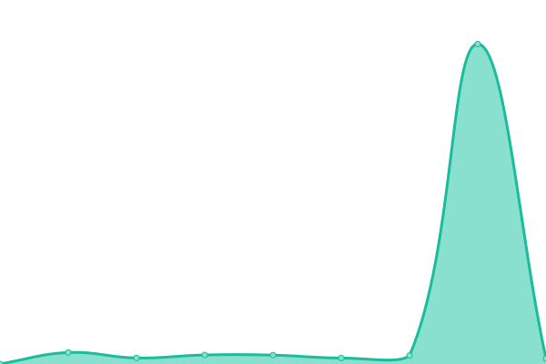
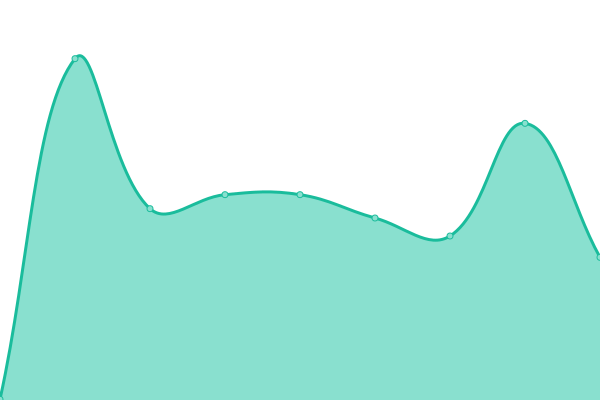

# [📈 Live Status](https://status.bloomqu.ist): <!--live status--> **🟧 Partial outage**

This repository contains the open-source uptime monitor and status page for [Zach Bloomquist](https://zach.bloomqu.ist), powered by [Upptime](https://github.com/upptime/upptime).

With [Upptime](https://upptime.js.org), you can get your own unlimited and free uptime monitor and status page, powered entirely by a GitHub repository. We use [Issues](https://github.com/flotwig/status.bloomqu.ist/issues) as incident reports, [Actions](https://github.com/flotwig/status.bloomqu.ist/actions) as uptime monitors, and [Pages](https://status.bloomqu.ist) for the status page.

<!--start: status pages-->
<!-- This summary is generated by Upptime (https://github.com/upptime/upptime) -->
<!-- Do not edit this manually, your changes will be overwritten -->
<!-- prettier-ignore -->
| URL | Status | History | Response Time | Uptime |
| --- | ------ | ------- | ------------- | ------ |
|  [Portfolio Site](https://zach.bloomqu.ist) | 🟩 Up | [portfolio-site.yml](https://github.com/flotwig/status.bloomqu.ist/commits/HEAD/history/portfolio-site.yml) | 

 271ms
     
 | 

<a href="https://status.bloomqu.ist/history/portfolio-site">100.00%</a>
    

|  [Spotify Now Playing](https://np.chary.us) | 🟥 Down | [spotify-now-playing.yml](https://github.com/flotwig/status.bloomqu.ist/commits/HEAD/history/spotify-now-playing.yml) | 

 156ms
     
 | 

<a href="https://status.bloomqu.ist/history/spotify-now-playing">99.98%</a>
    

|  [weeny.chary.us](https://weeny.chary.us) | 🟩 Up | [weeny-chary-us.yml](https://github.com/flotwig/status.bloomqu.ist/commits/HEAD/history/weeny-chary-us.yml) | 

 119ms
     
 | 

<a href="https://status.bloomqu.ist/history/weeny-chary-us">100.00%</a>
    

|  [NiftyHost Forums Archive](https://niftyhost.chary.us/support) | 🟥 Down | [nifty-host-forums-archive.yml](https://github.com/flotwig/status.bloomqu.ist/commits/HEAD/history/nifty-host-forums-archive.yml) | 

 313ms
     
 | 

<a href="https://status.bloomqu.ist/history/nifty-host-forums-archive">100.00%</a>
    

|  [IRIDESCENT STUDIO](https://iridescentstudio.io) | 🟩 Up | [iridescent-studio.yml](https://github.com/flotwig/status.bloomqu.ist/commits/HEAD/history/iridescent-studio.yml) | 

 224ms
     
 | 

<a href="https://status.bloomqu.ist/history/iridescent-studio">100.00%</a>
    

<!--end: status pages-->

[**Visit our status website →**](https://status.bloomqu.ist)

## 📄 License

- Powered by: [Upptime](https://github.com/upptime/upptime)
- Code: [MIT](./LICENSE) © [Anand Chowdhary](https://anandchowdhary.com), supported by [Pabio](https://pabio.com)
- Data in the `./history` directory: [Open Database License](https://opendatacommons.org/licenses/odbl/1-0/)
